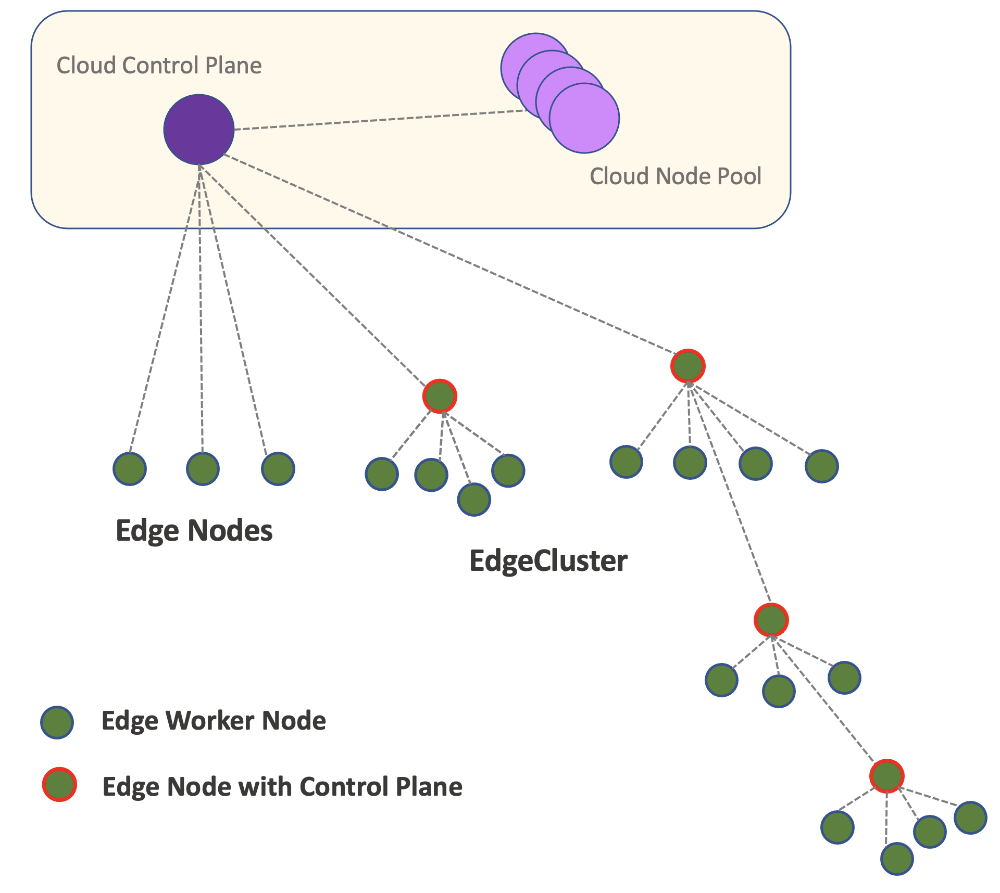

# Fornax 

Fornax is an open source edge-computing framework for managing compute resources on the edge environment. As one of the pillar projects of Centaurus, Fornax is designed to solve some of the key edge computing challenges such as limited computing resources, heterogeneous resource types, layered topology, unreliable network, and long latency. With Fornax, end-user's edge application workloads could be easily deployed in a distributed hierarchical edge environment with topologies that best matches the physical and logical structure. Fornax also offers high performance virtualized networking for workload communication within and between edge clusters. 

## Key Features  
Here are some of the distinguishing features of Fornax:

1. **Computing nodes and clusters on the edge**: Both computing nodes and clusters can run on the edge.  
2. **Hierarchical topology**: Edge clusters can be structured in multi-layer tree-like topologies, providing best mapping to end-user scenarios. 
3. **Flexible flavors**: Supports multiple flavors of clusters on the edge, e.g. Arktos, K8s and K3s.
4. **Edge networking**: Multi-tenant edge cluster networking (Supporting concepts like VPC, Subnet) and high performance inter-cluster communication.

## Design 
Fornax models edge as an [m-ary tree](https://en.wikipedia.org/wiki/M-ary_tree) where an [Arktos](https://github.com/CentaurusInfra/arktos) control plane sits at the root of the tree in the cloud, and leaf tree nodes represent computing nodes on the edge. The sub-trees in the m-ary tree are standalone clusters, and the roots of the sub-trees are control planes for edge clusters. As usual with Arktos clusters, there are also compute nodes in the cloud managed by the root level Arktos control plane.

The following graph is an example of such an edge model.

For detailed design please see the [design doc](docs/fornax-design/530_design.md)

## Release Plan
Fornax is targeting its first release in the later summer of 2021. Release plan can be found in the [release plan](docs/fornax-design/release_plan.md).

Resources:

- [Meeting notes and agenda](docs/meeting-notes)
- [Online meeting link](https://futurewei.zoom.us/j/93051877352?from=addon)
- [slack](https://arktosworkspace.slack.com/archives/C01AWKCCNLA)

## Contributing

If you're interested in being a contributor and want to get involved in the Fornax code, please see [CONTRIBUTING](./CONTRIBUTING.md) for details on submitting patches and the contribution workflow.

## License

Fornax is under the Apache 2.0 license. See the [LICENSE](LICENSE) file for details.
