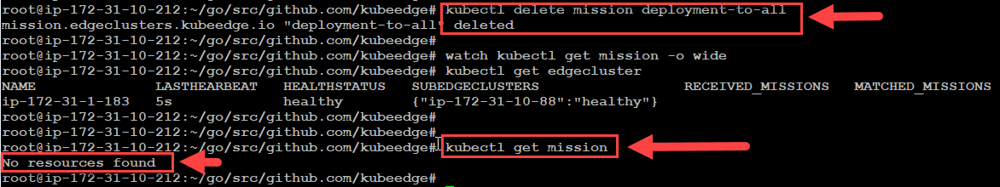

#	Edge Cluster Multi-Layer Setup and Configuration

## Abstract
The purpose of this document is how to set up and configuration hierarchical edge cluster, and describe each step to create virtual machine, setup the port number, install kubernets, GoLang, and so on. Running Cloud core and Edge core and deployed mission and task to Edge node. Improve the Edge computing. This Cloud and Edge design is derived from cloud end to edge end for Edge System Functional Description and the Setup Requirements Specification. The intended user of this program is the edge computing user. 
1. Virtual machine setup (create cloud core  and edge core virtual machine, and setup port),
2. Fornax installation and configuration (install all the kubernetes components: kubectl, kubeadm, kubelet),
3. GoLang installation and configuration (install all GoLang component and load the Fornax source code), 
4. Generate machine security certification, and deployed to virtual machine, 
5. Install CRD file in cloud core. 
6. Run cloud-core and edge-core and deployed mission and verify the mission.
7. You should be a root user.

## 1.1 Virtual Machine Setup and Configuration (We use AWS for example)
-	Ubuntu 18.04, Create virtual machine A to run an cloud-core, Create virtual machine B and C to run edge-core.
-	Open the port of 10000 and 10002 in the security group of the cloud-core machine and edge-core machine
- 	Go to doc and follow-up instruction to set up: [Virtual Machine Setup and Configuration](vm_setup.md).
- 	After done, you can continue to 1.2.

## 1.2	Install Kubernetes Tools
The general steps to install software tools to machine A (machine B and C have the same steps as machine A):
- 	Letting iptables see bridged traffic
-	Install kubernetes tools to virtual machine.(Make sure install version is: 1.21.1-00).
-	[Kubernetes Tools Doc](https://kubernetes.io/docs/setup/production-environment/tools/kubeadm/install-kubeadm/#installing-kubeadm-kubelet-and-kubectl)
- 	Install docker runtime
-	Installing kubeadm, kubelet and kubectl

###  1.2.1	Letting iptables see bridged traffic
•	Make sure that the br_netfilter module is loaded. This can be done by running **lsmod | grep br_netfilter**. To load it explicitly call **sudo modprobe br_netfilter**.
```Script
sudo modprobe br_netfilter
lsmod | grep br_netfilter

cat <<EOF | sudo tee /etc/modules-load.d/k8s.conf
br_netfilter
EOF

cat <<EOF | sudo tee /etc/sysctl.d/k8s.conf
net.bridge.bridge-nf-call-ip6tables = 1
net.bridge.bridge-nf-call-iptables = 1
EOF
sudo sysctl --system
```

- Verify the bridged
```
lsmod | grep br_netfilter
```
- Result:


###  1.2.2	Install docker runtime
- Install Docker runtime
```
sudo apt-get update
sudo apt-get install docker.io
```
###  1.2.3	Installing kubeadm, kubelet and kubectl
You will install these packages on all of your machines:

-	**kubeadm:** the command to bootstrap the cluster.

-	**kubelet:** the component that runs on all the machines in your cluster and does things like starting pods and containers.

-	**kubectl:** the command line util to talk to your cluster.

	1. Update the apt package index and install packages needed to use the Kubernetes apt repository:
	```
	sudo apt-get update
	sudo apt-get install -y apt-transport-https ca-certificates curl
	```
	2. Download the Google Cloud public signing key:
	```
	sudo curl -fsSLo /usr/share/keyrings/kubernetes-archive-keyring.gpg https://packages.cloud.google.com/apt/doc/apt-key.gpg
	```
	3. Add the Kubernetes apt repository:
	```
	echo "deb [signed-by=/usr/share/keyrings/kubernetes-archive-keyring.gpg] https://apt.kubernetes.io/ kubernetes-xenial main" | sudo tee /etc/apt/sources.list.d/kubernetes.list
	```
	4. Update apt package index, install kubelet, kubeadm and kubectl, and pin their version:
	```
	sudo apt-get update
	apt-get install -qy kubelet=1.21.1-00 kubectl=1.21.1-00 kubeadm=1.21.1-00
	sudo apt-mark hold kubelet kubeadm kubectl
	```

- Next, run the command to enable docker service systemctl enable docker.service
```
systemctl enable docker.service
```

###  1.2.4	Start a cluster using kubeadm
- (referring doc: https://kubernetes.io/docs/setup/production-environment/tools/kubeadm/create-cluster-kubeadm/)
- 1. Run command (it might cost a few minutes)
```
kubeadm init
```
- 2. At the end of the screen output, you will see info about setting the kubeconfig. Do the following if you are the root user:
 ```
 export KUBECONFIG=/etc/kubernetes/admin.conf
 ```
- 3. Check the cluster is up by running some commands, like
```
kubectl get nodes
```


## 1.3	Install GoLang Tools
You should be a root user
###  1.3.1	Install GoLang
- You should in root folder (**copy command line  should line by line to run**).
	```
	GOLANG_VERSION=${GOLANG_VERSION:-"1.14.15"}
	
	sudo apt -y update
	
	sudo apt -y install make
	
	sudo apt -y install gcc jq
	
	wget https://dl.google.com/go/go${GOLANG_VERSION}.linux-amd64.tar.gz -P /tmp
	
	sudo tar -C /usr/local -xzf /tmp/go${GOLANG_VERSION}.linux-amd64.tar.gz
	```
	notes: you can use following command see the package list
	```
	apt list --upgradable
	```
- Instal vim
```
sudo apt-get install vim
```
###  1.3.2	Configuration GoLang Path.
- Open "~/.bashrc" file and add two line to file end, then save and exit
```
vi ~/.bashrc

export PATH=$PATH:/usr/local/go/bin
export GOPATH=/usr/local/go/bin
export KUBECONFIG=/etc/kubernetes/admin.conf
```
- run following line and let source file effective. The check version and environment value.
```
source ~/.bashrc
```
- run following line and verify Go version.
```
go version
```
you will see "go version go1.14.15 linux/amd64"

###  1.3.3	Setup project location.
- create project folder
```
mkdir -p go/src/github.com
```
- go to project folder
```
cd go/src/github.com
```
- clone fornax repo, change name to "kubeedge", go to "kubeedge" folder, and compile code by "make all"
```
git clone https://github.com/CentaurusInfra/fornax.git
mv fornax kubeedge
cd kubeedge
make all
```
- if you want to modify the source code, you need create your practice branch.
```
git checkout -b practicebransh
```
The machine A software installation is done  

### 1.3.4    Setup machine B and machine C 
Repeat steps from 1.2.1 to 1.3.3, install all software tools to machine B and C.

## 1.4.	Fornax Configuration
###  1.4.1	Kubecofig File Preparation
Summary
- Copy the admin kubeconfig file of cluster A to machine B, the kubecofig file of cluster B to the machine of cluster C.
- Copy the kubeconfig files of cluster A, B, and C to the root operator machine.
- Detail see 1.4.2 to 1.4.4

###  1.4.2	In machine A, do following

1. Clone a repo of https://github.com/CentaurusInfra/fornax, sync to the branch/commit to test. (**See 1.3.3. for detail**)
Build the binaries of edgecore and cloudcore using the commands
```
make WHAT=cloudcore
make WHAT=edgecore
```
2. Config cloudcore
- notes: following command line only run at first time.
```
mkdir /etc/kubeedge/config -p
```

```
cp /etc/kubernetes/admin.conf /root/.kube/config
_output/local/bin/cloudcore --minconfig > /etc/kubeedge/config/cloudcore.yaml
```
- **Notes:** if you run above command and meeting error "/etc/kubeedge/config/cloudcore.yaml: No such file or directory", do following command
```
mkdir /etc/kubeedge/config -p
mkdir /root/.kube/config -p
```

3. Generate certificates
Note down the IP address of machine A, B, and C denotes as IP_A, IP_B, and IP_C, and run the command:
- Befoe run certgen.sh, create directory, "mkdir -p /etc/kubeedge/ca"

- Notes: if you cannot generate certkey: you need modify /etc/ssl/openssl.cnf file. Open file by vi and Try **removing or commenting "RANDFILE = $ENV::HOME/.rnd" line**.
[for doc reference](https://stackoverflow.com/questions/63893662/cant-load-root-rnd-into-rng/)

```
vi /etc/ssl/openssl.cnf
```

```
mkdir -p /etc/kubeedge/ca
build/tools/certgen.sh genCA IP_A IP_B IP_C
build/tools/certgen.sh genCertAndKey server IP_A IP_B IP_C
```
4. Then copy the files of folder /etc/kubeedge/ca and /etc/kubeedge/certs in machine A to the folder of /etc/kubeedge/ca and /etc/kubeedge/certs in machine B, and C.
For detail, you can reference: <a href="copy_cert_between_edge_cluster.md" target="_blank"> File or Folder Copy Process Between Edge cluster </a>

5. Install CRDs
- 	The *Mission* CRD is used to carry workload information through edge cluster layers, and therefore workload information is stored as a part of the *[Mission/State]* definition called "State".

- For first line mostly use "export KUBECONFIG=/etc/kubernetes/admin.conf".
```
export KUBECONFIG=[Cluster_A_kubeconfig_file]

kubectl apply -f build/crds/devices/devices_v1alpha2_device.yaml
kubectl apply -f build/crds/devices/devices_v1alpha2_devicemodel.yaml 

kubectl apply -f build/crds/reliablesyncs/cluster_objectsync_v1alpha1.yaml
kubectl apply -f build/crds/reliablesyncs/objectsync_v1alpha1.yaml 

kubectl apply -f  build/crds/router/router_v1_rule.yaml
kubectl apply -f  build/crds/router/router_v1_ruleEndpoint.yaml

kubectl apply -f build/crds/edgecluster/mission_v1.yaml
kubectl apply -f build/crds/edgecluster/edgecluster_v1.yaml
```


###  1.4.3	In machine B, do following

1. Clone a repo of https://github.com/CentaurusInfra/fornax, sync to the branch/commit to test. (**See 1.3.3. for detail**)
Build the binaries of edgecore and cloudcore using the commands
```
make WHAT=cloudcore
make WHAT=edgecore
```
2. config cloudcore
- notes: following command line only run at first time.
```
mkdir /etc/kubeedge/config -p
```

```
cp /etc/kubernetes/admin.conf /root/.kube/config
_output/local/bin/cloudcore --minconfig > /etc/kubeedge/config/cloudcore.yaml
```


3. config edgecore
 
* Copy kubeconfig files of all the clusters in directory `/etc/fornax/configs/` in format cluster_hostname.kubeconfig   

```
mkdir /etc/fornax/configs/ -p
cp [Cluster_B_kubeconfig_file] /etc/fornax/configs/[Cluster_Hostname.kubeconfig]
_output/local/bin/edgecore --edgeclusterconfig > /etc/kubeedge/config/edgecore.yaml
tests/edgecluster/hack/update_edgecore_config.sh [cluster_A_kubeconfig_file]

```

* Notes: `Cluster_Hostname` is hostname of machine. 

###  1.4.4	In machine C, do following

1. Clone a repo of https://github.com/CentaurusInfra/fornax, sync to the branch/commit to test. (**See 1.3.3. for detail**)
Build the binaries of edgecore and cloudcore using the commands
```
make WHAT=cloudcore
make WHAT=edgecore
```

2. config edgecore
* Copy kubeconfig files of all the clusters in directory `/etc/fornax/configs/` in format cluster_hostname.kubeconfig

- notes: following command line only run at first time.
```
mkdir /etc/kubeedge/config -p
```

```
mkdir /etc/fornax/configs/ -p
cp [Cluster_C_kubeconfig_file] /etc/fornax/configs/[cluster_hostname.kubeconfig]
_output/local/bin/edgecore --edgeclusterconfig > /etc/kubeedge/config/edgecore.yaml
tests/edgecluster/hack/update_edgecore_config.sh [cluster_B_kubeconfig_file]
```


# 2	Run Fornax Cluster in Machine B, C
## Summary
- Use tmux and split window. Run following sequence steps.
- Step 1: machine A cloud core
- Step 2: machine B edge core
- Step 3: machine B cloud core
- Step 4: machine C edge core
- Step 5: back to machine A second window to run deployment command and other command(kubectl get edgecluster, kubectl get mission)
- Each *Mission* can be deployed to multiple clusters, so the status is a collection of all workloads from the same *Mission*.

##  2.1		In machine A.
- If you have tmux on your machine, split two window view. Otherwise start two command window. One window run the cloud-core, One window check cluster status
### 2.1.1 One window run following cloudcore command line (notes: machine A only run cloudcore)(Step 1):
```
export KUBECONFIG=/etc/kubernetes/admin.conf
_output/local/bin/cloudcore

```
Result:

     
### 2.1.2 Another window run following line, to check machine status and mission deployment status (Step 5)
```
kubectl get crd
kubectl get edgecluster
kubectl get mission
```

##  2.2		In machine B. (Notes: If we have C machine, we need also run "cloudcore" in machine B.)
### 2.2.1 Run edgecore in machine B (Step 2)
- following command line only run one time.
```
chmod 777 /root/go/src/github.com/kubeedge/_output/local/bin/kubectl/vanilla/kubectl
```
```
export KUBECONFIG=/etc/kubernetes/admin.conf
_output/local/bin/edgecore --edgecluster
```
- Notes: If you first time to run above command, please run the following command. only run one time.
```
chmod 777 /root/go/src/github.com/kubeedge/_output/local/bin/kubectl/vanilla/kubectl
```

### 2.2.2 Run cloudcore in machine B (if you have machine C) (Step 3)
```
export KUBECONFIG=/etc/kubernetes/admin.conf
_output/local/bin/cloudcore
```
Result:


##  2.3		In machine C. (only run edgecore)
### 2.3.1 Run edgecore in machine C (Step 4)
- following command line only run one time.
```
chmod 777 /root/go/src/github.com/kubeedge/_output/local/bin/kubectl/vanilla/kubectl
```
```
export KUBECONFIG=/etc/kubernetes/admin.conf
_output/local/bin/edgecore --edgecluster
```
- Notes: If you first time to run above command, please run the following command. only run one time.
```
chmod 777 /root/go/src/github.com/kubeedge/_output/local/bin/kubectl/vanilla/kubectl
```

Result:


# 3	Deployment Mission to Machine B, C
## 3.1	Waiting machine A, B, C running, we can start 3.2
## 3.2  In machine A, do following command in Second Command Window.

```
kubectl apply -f tests/edgecluster/data/missions/deployment-to-all.yaml
```
you will see one line have the message **Mission deployment-to-all is created**. detail see the result
<BR>Result:


## 3.3 Run following command verify mission created status(in second window).
```
kubectl get edgeclusters
kubectl get missions
```
Result:

     
## 3.4 After you see mission, you can test delete mission. by using following command
```
kubectl delete mission deployment-to-all
```
## 3.5 Run following command verify mission deteted status(in second window).
```
kubectl get edgeclusters
kubectl get missions
```
OR
```
watch kubectl get edgeclusters
watch kubectl get missions
```
	
Result:



# 4	Tips & Tricks
## 4.1  When you finished run the cloudcore and edgecore. Please use "Ctrl + c" exit running.
- If you use tmux, make sure use "Ctrl + c" exit running. If you accidently exit window, please use following command back to exit or terminate runing.
```
tmux ls
tmux a
```
- If you have more session in previous, you can go to specific session by following command
```
tumx a -t [session number in the list]
```
- If you only want to kill specific process, you can use following command (use kill command to kill the process. use ps auxw|grep core to find all process id )
```
ps auxw | grep core
kill [process number]
```

