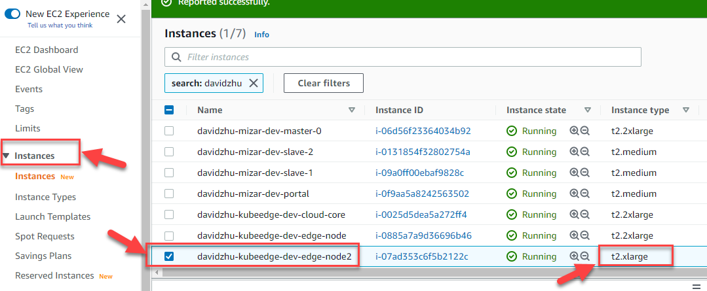
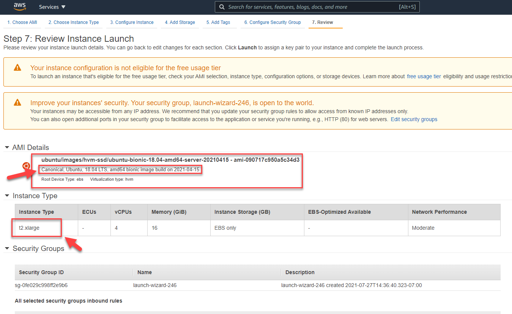
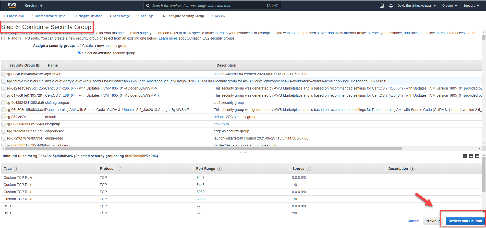
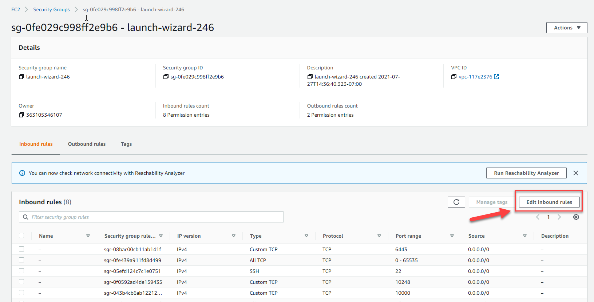

#	Edge Cluster Multi-Layer Setup and Configuration

## Abstract
The purpose of this document is to how to setup and configuration Cloud core and Edge core , and describe the each step to create virtual machine, setup the port number, install kubernets, GoLang, and so on. Running Cloud core and Edge core and deployed mission and task to Edge node. Improve the Edge computing. This Cloud and Edge design is derived from cloud end to edge end for Edge System Functional Description and the Setup Requirements Specification. The intended user of this program is the edge computing user. 
1. Virtual Machine Setup (create Cloud core  and Edge core virutal machine, and setup port),
2. Fornax Installation and Configuration (Install all the kubernetes compnents: kubectl, kubadm, bubelet),
3. GoLang Installlation and Configuration (Install all GoLang component and load the Fornax source code), 
4. Generate Machine Security certification, and deployed to virtual machine, 
5. Install CRD file in Cloud core. 
6. Run cloud-core and edge-core and deployed mission and verify the mission.

## 1.1. Virtual Machine Setup and Configuration (We use AWS for example)
-	Ubuntu 18.04, one for cloud-core, two for edge-core.
-	Open the port of 10000 and 10002 in the security group of the cloud-core machine and edge-core machine

### 1.1.1. SETUP CLOUD CORE VIRTUAL MACHINE
-	This Step to create Cloud core in AWS. And Setup port and security, disk space, Unix Ubuntu machine.
-	If you already have similarity machine, you can follow step to create a virtual machine (if you did not have, and you can create brand new from the scratch).
-	In AWS EC2, pickup instance which you want to copy. Then pickup “Launch more like this”.


     

     
- 	You will get following screen for review.  

-	Change disksapce size to 80G 

- 	Give a Tags name. see screen shot.

- 	Click "Review and Launch" button to review.

- 	Click "Launch"

- 	It will pop up a window, pickup "Choose an existing key pair" and edge-team-key|RSA. Check "checkbox", then click "Launch Instance"

- Waiting virtual machine to launch. The following window will show. Then  click "View Instance"


- 	Your instance  will be  running.

- 	Add prot number 10000 and 10002.



- 	Click "Edit inbound rules"


- 	Finally you will see 10000 and 10002 port.


###  1.1.2.	REPEAT 1.1.1 CREATE TWO EDGE-CORE Virtual Machine
•	Create two Edge core in AWS. And Setup port and security, disk space, Unix Ubuntu machine.


## 1.2.	Install Kubernetes Tools to Cloud core and Edge core
-	Install kubernetes tools to virtual machine.(Make sure install version is: 1.21.1-00).
- 	<a href="https://kubernetes.io/docs/setup/production-environment/tools/kubeadm/install-kubeadm/#installing-kubeadm-kubelet-and-kubectl" target="_blank">Kubernetes Tools Doc</a>
- 	Letting iptables see bridged traffic
- 	Install docker runtime
-	Installing kubeadm, kubelet and kubectl

###  1.2.1.	Letting iptables see bridged traffic
•	Make sure that the br_netfilter module is loaded. This can be done by running **lsmod | grep br_netfilter**. To load it explicitly call **sudo modprobe br_netfilter**.
```Script
cat <<EOF | sudo tee /etc/modules-load.d/k8s.conf
br_netfilter
EOF

cat <<EOF | sudo tee /etc/sysctl.d/k8s.conf
net.bridge.bridge-nf-call-ip6tables = 1
net.bridge.bridge-nf-call-iptables = 1
EOF
sudo sysctl --system
```
###  1.2.2.	Install docker runtime
- Install Docker runtime
```
sudo apt-get install docker.io
```
###  1.2.3.	Installing kubeadm, kubelet and kubectl
You will install these packages on all of your machines:

-	**kubeadm:** the command to bootstrap the cluster.

-	**kubelet:** the component that runs on all of the machines in your cluster and does things like starting pods and containers.

-	**kubectl:** the command line util to talk to your cluster.

	1. Update the apt package index and install packages needed to use the Kubernetes apt repository:
	```
	sudo apt-get update
	sudo apt-get install -y apt-transport-https ca-certificates curl
	```
	2. Download the Google Cloud public signing key:
	```
	sudo curl -fsSLo /usr/share/keyrings/kubernetes-archive-keyring.gpg https://packages.cloud.google.com/apt/doc/apt-key.gpg
	```
	3. Add the Kubernetes apt repository:
	```
	echo "deb [signed-by=/usr/share/keyrings/kubernetes-archive-keyring.gpg] https://apt.kubernetes.io/ kubernetes-xenial main" | sudo tee /etc/apt/sources.list.d/kubernetes.list
	```
	4. Update apt package index, install kubelet, kubeadm and kubectl, and pin their version:
	```
	sudo apt-get update
	apt-get install -qy kubelet=1.21.1-00 kubectl=1.21.1-00 kubeadm=1.21.1-00
	sudo apt-mark hold kubelet kubeadm kubectl
	```

- Next, run the command to enable docker service systemctl enable docker.service

###  1.2.4.	Start a cluster using kubeadm
- (referring doc: https://kubernetes.io/docs/setup/production-environment/tools/kubeadm/create-cluster-kubeadm/)
- 1. Run command (it might cost a few minutes)
```
kubeadm init
```
- 2. At the end of the screen output, you will see info about setting the kubeconfig. Do the following if you are the root user:
 ```
 export KUBECONFIG=/etc/kubernetes/admin.conf
 ```
- 3. Check the cluster is up by running some commands, like
```
kubectl get nodes
```


## 1.3.	Install GoLang Tools to Cloud core and Edge core
###  1.3.1.	Install GoLang
- You should in root folder.
	```
	GOLANG_VERSION=${GOLANG_VERSION:-"1.14.15"}
	sudo apt -y update
	sudo apt -y install make
	sudo apt -y install gcc
	sudo apt -y install jq
	wget https://dl.google.com/go/go${GOLANG_VERSION}.linux-amd64.tar.gz -P /tmp
	sudo tar -C /usr/local -xzf /tmp/go${GOLANG_VERSION}.linux-amd64.tar.gz
	```
- Instal vim
```
sudo apt-get install vim
```
###  1.3.2.	Configuration GoLang Path.
- Open "~/.bashrc" file and add two line to to file end, then save and exit
```
vi ~/.bashrc

export PATH=$PATH:/usr/local/go/bin
export GOPATH=/usr/local/go/bin
```
- run following line and let source file effective. The check version and environment value.
```
source ~/.bashrc

go version

go env
```
###  1.3.3.	Setup project location.
- create project folder
```
mkdir -p go/src/github.com
```
- go to project folder
```
cd go/src/github.com
```
- clone fornax repo, change name to Kubeedge, go to "kubeedge" folder, and compile code by "make all"
```
git clone https://github.com/CentaurusInfra/fornax.git
mv fornax kubeedge
cd kubeedge
make all
```
- if you want to modify the source code, you need create your practice branch.
```
git checkout -b practicebransh
```

## 1.4.	Fornax Configuration
###  1.4.1.	Kubecofig File Preparation
- Copy the admin kubeconfig file of cluster A to machine B, the kubecofig file of cluster B to the machine of cluster C.

- Copy the kubeconfig files of cluster A, B, and C to the root operator machine.

###  1.4.2.	In machine A, do following

1. Clone a repo of https://github.com/CentaurusInfra/fornax, sync to the branch/commit to test. (**See 1.3.3. for detail**)
Build the binaries of edgecore and cloudcore using the commands
```
make WHAT=cloudcore
make WHAT=edgecore
```
2. config cloudcore
```
cp /etc/kubernetes/admin.conf /root/.kube/config
_output/local/bin/cloudcore --minconfig > /etc/kubeedge/config/cloudcore.yaml
```
3. Generate security data
Note down the IP address of machine A, B, and C denotes as IP_A, IP_B, and IP_C, and run the command:

```
build/tools/certgen.sh genCA IP_A IP_B IP_C
build/tools/certgen.sh genCertAndKey server IP_A IP_B IP_C
```
4. Then copy the files of folder /etc/kubeedge/ca and /etc/kubeedge/certs in machine A to the folder of /etc/kubeedge/ca and /etc/kubeedge/certs in machine B, and C.

5. Install CRDs
- 	The *Mission* CRD is used to carry workload information through edge cluster layers, and therefore workload information is stored as a part of the *[Mission/State]* definition called "State".

- For first line mostly use "export KUBECONFIG=/etc/kubernetes/admin.conf".
```
export KUBECONFIG=[Cluster_A_kubeconfig_file]

kubectl apply -f build/crds/devices/devices_v1alpha2_device.yaml
kubectl apply -f build/crds/devices/devices_v1alpha2_devicemodel.yaml 

kubectl apply -f build/crds/reliablesyncs/cluster_objectsync_v1alpha1.yaml
kubectl apply -f build/crds/reliablesyncs/objectsync_v1alpha1.yaml 

kubectl apply -f  build/crds/router/router_v1_rule.yaml
kubectl apply -f  build/crds/router/router_v1_ruleEndpoint.yaml

kubectl apply -f build/crds/edgecluster/mission_v1.yaml
kubectl apply -f build/crds/edgecluster/edgecluster_v1.yaml
```


###  1.4.3.	In machine B, do following

1. Clone a repo of https://github.com/CentaurusInfra/fornax, sync to the branch/commit to test. (**See 1.3.3. for detail**)
Build the binaries of edgecore and cloudcore using the commands
```
make WHAT=cloudcore
make WHAT=edgecore
```
2. config cloudcore
```
cp /etc/kubernetes/admin.conf /root/.kube/config
_output/local/bin/cloudcore --minconfig > /etc/kubeedge/config/cloudcore.yaml
```


3. config edgecore
```
cp [Cluster_B_kubeconfig_file] /root/edgecluster.kubeconfig
_output/local/bin/edgecore --edgeclusterconfig > /etc/kubeedge/config/edgecore.yaml
tests/edgecluster/hack/update_edgecore_config.sh [cluster_A_kubeconfig_file]

```

###  1.4.4.	In machine C, do following

1. Clone a repo of https://github.com/CentaurusInfra/fornax, sync to the branch/commit to test. (**See 1.3.3. for detail**)
Build the binaries of edgecore and cloudcore using the commands
```
make WHAT=cloudcore
make WHAT=edgecore
```
2. config cloudcore
```
cp /etc/kubernetes/admin.conf /root/.kube/config
_output/local/bin/cloudcore --minconfig > /etc/kubeedge/config/cloudcore.yaml
```


3. config edgecore
```
cp [Cluster_C_kubeconfig_file] /root/edgecluster.kubeconfig
_output/local/bin/edgecore --edgeclusterconfig > /etc/kubeedge/config/edgecore.yaml
tests/edgecluster/hack/update_edgecore_config.sh [cluster_B_kubeconfig_file]
```


# 2	Run Fornax Cluster and Deployment Mission to Machine B, C

- Each *Mission* can be deployed to multiple clusters, so the status is a collection of all workloads from the same *Mission*.

##  2.1.	In machine A.
- If you have tmux on your machine, split two window view. Otherwise start two command window. One window run the cloud-core, One window check cluster status
### 2.1.1. One window run following cloudcore command line (notes: machine A only run cloudcore):
```
export KUBECONFIG=/etc/kubernetes/admin.conf
_output/local/bin/cloudcore

```
### 2.1.2 Another window run following line, to check machine status and mission deployment status
```
kubectl get crd
kubectl get edgecluster
kubectl get mission
```

##  2.2.	In machine B. (Notes: If we have C machine, we need also run "cloudcore" in machine B.)
### 2.2.1. Run cloudcore in machine B 
```
export KUBECONFIG=/etc/kubernetes/admin.conf
_output/local/bin/cloudcore
```
### 2.2.2 Run edgecore in machine B
```
export KUBECONFIG=/etc/kubernetes/admin.conf
_output/local/bin/edgecore --edgecluster
```

##  2.3.	In machine C. (only run edgecore)
```
export KUBECONFIG=/etc/kubernetes/admin.conf
_output/local/bin/edgecore --edgecluster
```

##  2.4.	Deployment Mission to Machine B, C
### 2.4.1. Waiting machine A, B, C running, we can run following command and test mission deployment
### 2.4.2.  In machine A, do following command in Second Command Window.

```
kubectl apply -f tests/edgecluster/data/missions/deployment-to-all.yaml
```
-	you will see the line: I1110 22:14:59.920280     986 mission_deployer.go:125] **Mission deployment-to-all is created**

### 2.4.3. Run following command verify mission created status.
```
kubectl get edgecluster
kubectl get mission
```
### 2.4.4. After you see mission, you can test delete mission. by using following command
```
kubectl delete mission deployment-to-all
```
### 2.4.5. Run following command verify mission deteted status.
```
kubectl get edgecluster
kubectl get mission
```


