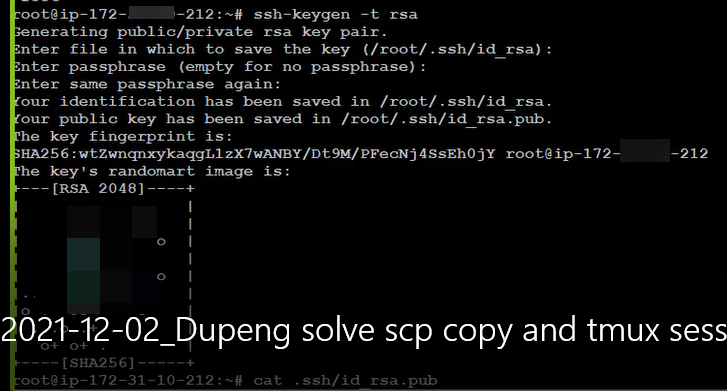
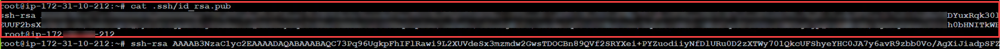
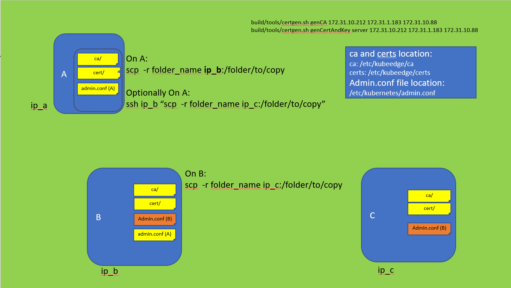

#	File or Folder Copy Process Between Edge cluster(For Reference)

## Abstract
The purpose of this document is to how to copy file or folder in machine A to machine B and C Virtual Machine(or Cluster), and describe the each step to create copy process and refence documentation.
If you have own way to copy, you can use your own way to copy and skip this doc.
1. Reference document at this link: <a href="http://www.linuxproblem.org/art_9.html" target = "_blank"> SSH login without password </a>
2. Generate public key in machine A if you want to copy A file or folder to machine B.
3. Copy the public key in A to machine B.
4. Do copy process.

## 1.1. Generate Key in machine A and copy pub key to machne B 
-	Ubuntu 18.04, one for cloud-core, two for edge-core.

### 1.1.1. Generate Key in root at machine A
-	Run following command and keep "Enter" key, until key generated.
```
ssh-keygen -t rsa
```
Result:


### 1.1.2. Open pub key in B.
```
cat .ssh/id_rsa.pub
```
or
```
vi .ssh/id_rsa.pub
```
Result:


### 1.1.3. Copy pub key to Machine B.
Connect to machine B and opend .ssh/authorized_keys
```
vi .ssh/authorized_keys
```
you need append machine A public key to authorized_keys.
Result:


  
### 1.1.4. Follow up 1.1.1 to 1.1.3 Copy Machine A pub key to Machine C.
### 1.1.5. Follow up 1.1.1 to 1.1.3 Copy Machine B pub key to Machine C. (notes: we need copy machine B "admin.conf" to machine C).

     
     
# 2. Copy ca, certs, admin.conf from machine A to machine B, C
-	Ubuntu 18.04, one for cloud-core, two for edge-core.
-	You need know your machine private ip.
-	Copy Structure Overview


## 2.1. Copy machine A security file to machine B 
## 2.1.1. Copy ca, certs from machine A to machine B
- notes: replace machine_B_IP with your ip address. also remove square bracess
```
scp -r /etc/kubeedge/ca  [machine_B_IP]:/etc/kubeedge/
scp -r /etc/kubeedge/cert [machine_B_IP]:/etc/kubeedge/
```

## 2.1.2. Copy "admin.conf" from machine A to machine B
- notes: Copy machine A "admin.conf" to machine B, and put one location and easy to use. when run edgecore setting, we need this file. most time put name as **"adminA.conf"**.
```
scp /etc/kubernetes/admin.conf [machine_B_IP]:/root/go/src/github.com/kubeedge/[sample_folder]
```

## 2.3. Copy machine A security file to machine C 
## 2.1.1. Copy ca, certs from machine A to machine C
- notes: replace machine_B_IP with your ip address. also remove square bracess
```
scp -r /etc/kubeedge/ca  [machine_B_IP]:/etc/kubeedge/
scp -r /etc/kubeedge/cert [machine_B_IP]:/etc/kubeedge/
```

## 2.1.2. Copy "admin.conf" from machine B to machine C
- notes: Copy machine B "admin.conf" to machine C, and put one location and easy to use. when run edgecore setting, we need this file. most time put name as **"adminB.conf"**.
```
scp /etc/kubernetes/admin.conf [machine_B_IP]:/root/go/src/github.com/kubeedge/[sample_folder]
```
