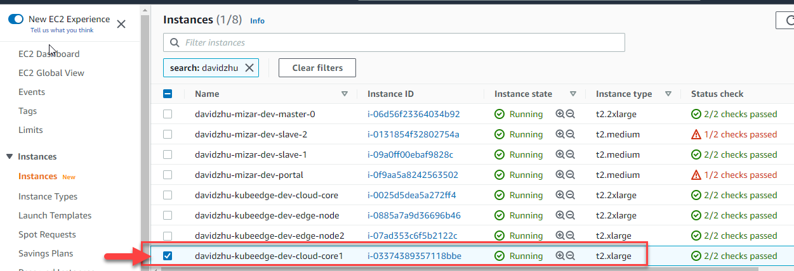

#	Create, Setup and Configuration Virtual Machine

## Abstract
The purpose of this document is how to create, setup and configuration virtual machine, and describe the each step to create virtual machine, setup the port number.
1. Instruction for create virtual machine (create virtual machine A as cloud core, create virtual machine B and C as edge core).

## 1.1. Create Virtual Machine, and Setup and Configuration (We use AWS for example)
-	Ubuntu 18.04, one for cloud-core, two for edge-core.
-	Open the port of 10000 and 10002 in the security group of the cloud-core machine and edge-core machine
-	**Create virtual machine from brand new instance. See 1.1.1**
-	**Create virtual machine from exit instance. See 1.1.2**

### 1.1.1 Create Clore Core Virtual Machine A From Brand New Instance
- Select instance launch from the right up corner

- Select vertiual machine type: Ubuntu 18.04

     
- Choose Instance Type : t2.large or t2.xlarge

     
- Configure Instance: 

     
- Add Storage

     
- Add Tags

     
- Configure Security Group

     
- Review

     
- Select Key pair

     
- Final review and launch

### 1.1.2 Create Cloud Core Virtual Machine From Exist Instance.
-	This Step to create Cloud core in AWS. And Setup port and security, disk space, Unix Ubuntu machine.
-	If you already have similarity machine, you can follow step to create a virtual machine (if you did not have, and you can create brand new from the scratch).
-	In AWS EC2, pickup instance which you want to copy. Then pickup “Launch more like this”.

     

     
- 	You will get following screen for review.  

-	Change disksapce size to 80G 

- 	Give a Tags name. see screen shot.

- 	Click "Review and Launch" button to review.

- 	Click "Launch"

- 	It will pop up a window, pickup "Choose an existing key pair" and edge-team-key|RSA. Check "checkbox", then click "Launch Instance"

- Waiting virtual machine to launch. The following window will show. Then  click "View Instance"

- 	Your instance  will be  running.

- 	Add prot number 10000 and 10002.

- 	Click "Edit inbound rules"

- 	Finally you will see 10000 and 10002 port.

###  1.1.3	Repeat 1.1.1 Create B and C Edgecore Virtual Machine
•	Create two Edge core virtual machine(B and C) in AWS. And Setup port and security, disk space, Unix Ubuntu machine.

###  1.1.4	After you done above section, go to 1.2  [Install Kubernetes Tools](cluster_setup.md)
